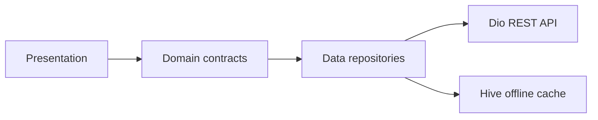

# Pulseboard


Pulseboard is a Flutter certification project for a production-minded mobile app: JWT authentication, REST data, local offline cache, accessible UI, French and English, and automated testing.

## App preview

Every successful Android CI run uploads a `pulseboard-demo-android` artifact containing a release APK and a screenshot of the login screen. Open [the latest workflow runs](https://github.com/kezi-stack/flutter-certification-pulseboard/actions/workflows/flutter.yml) and download the artifact from a completed run.

The Android job also runs the app's integration tests on an API 35 emulator before building the demo APK.

## Features

- Login, registration, and logout with access and refresh JWTs.
- Overview dashboard with live user, post, and task counts.
- Five main sections: Overview, Users, Posts, Tasks, and Settings.
- REST-backed content with Hive cache fallback when offline.
- Pull-to-refresh, retry states, and open/completed task filters.
- French and English UI, switchable from login or Settings.
- Semantic labels for interactive controls and meaningful user-avatar descriptions.
- Lazy list rendering; user images load only as rows appear and are decoded at 96 × 96 pixels for a 48-pixel display.
- Clean Architecture boundaries between data, domain, and presentation.

## Architecture

```text
lib/
├── core/          # failures and UI strings
├── data/          # Dio client, DTOs, Hive store, repositories
├── domain/        # models, repository contracts, validation, statistics
└── presentation/  # login, five app sections, reusable list states

test/
├── support/       # fake repositories shared with integration tests
├── *test.dart     # repository, domain, and widget tests
integration_test/  # end-to-end flows on an Android emulator
```

The UI talks to repository contracts in `domain/`. The data layer implements those contracts using Dio and Hive; the UI does not depend on the network client or cache implementation.



## Requirements

- Flutter stable and its bundled Dart SDK.
- Android SDK and an emulator or Android device to run integration tests.

## Run locally

```bash
flutter pub get
flutter analyze --fatal-infos --fatal-warnings
flutter test --coverage
flutter run
```

To run the end-to-end tests on an available Android emulator:

```bash
flutter test integration_test
```

The GitHub Actions workflow uses Flutter stable, runs analysis and unit/widget tests, then runs integration tests on Android API 35 and builds a release APK.

## Demo account

```text
Username: admin
Password: Password@123
```

The demo account is provided by the public Playground API. For development, avoid reusing credentials from personal accounts.

## API

The app uses [Playground API](https://playground.nileslabs.com/docs) at `https://playground.nileslabs.com/api/v1` for login, registration, the current session, users, posts, and tasks.

When a content request fails, the repository returns the last cached response from Hive. If there is no cached copy, the UI shows an actionable error and retry control.

## Automated checks

| Check | Command | Coverage |
|---|---|---|
| Static analysis | `flutter analyze --fatal-infos --fatal-warnings` | All Dart sources |
| Unit tests | `flutter test --coverage` | Form validation, dashboard statistics, task filtering, repositories, authentication, token refresh |
| Widget tests | Included in `flutter test` | Login, localization, registration, navigation, Settings |
| Integration tests | `flutter test integration_test` | Sign-in, section navigation, localization |
| Android demo | `flutter build apk --release` | Release APK built in CI and uploaded with the login screenshot |

Tests use fake repositories at the presentation and integration layers. Repository tests use mocked Dio requests, so they do not depend on the public API being available.

## Performance and accessibility

Lists use `ListView.builder` through `ListView.separated`, retaining only visible rows. Network avatars are decoded to a small target size and have a local initials fallback. Repository futures are created once per screen and retained while switching tabs; static visual subtrees use `const` constructors where possible.

Navigation destinations, icon actions, form labels, task filters, progress, and avatars expose descriptive labels or values to assistive technology. The layout follows Material 3 and supports system text scaling.

The CI checks static analysis, test behavior, and a release build. Frame-rate consistency is device-dependent; profile the app on a representative physical device before making a 60 fps production claim.

## Changelog

See [CHANGELOG.md](CHANGELOG.md) for the three documented project versions.
